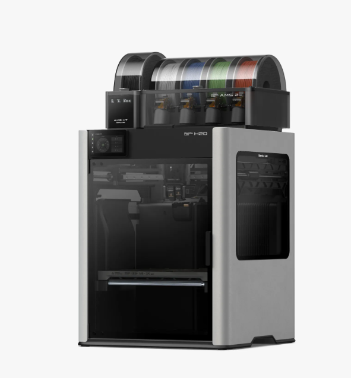
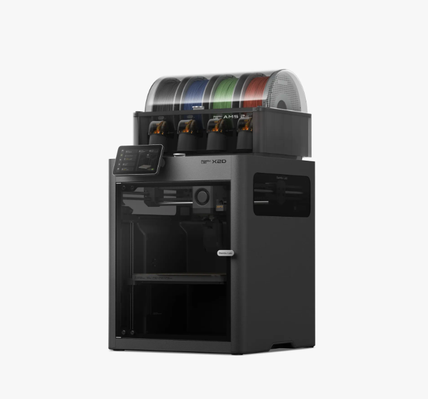

If you've been loosely following Bambu Lab news, you already know they've been on a tear. In the span of about a year, they released multiple new machines, discontinued their flagship X1 Carbon, and just this week dropped a brand-new printer that undercut everyone's price expectations. It's a lot to keep up with — so here's a breakdown of what's actually out there right now and what each machine is trying to do.

---

## Why So Many New Printers?

Bambu's original lineup — the X1C, P1P, P1S, A1 — dominated the prosumer FDM space for a couple of years. Fast prints, solid AMS integration, good software. But the X1C was still a single-nozzle machine when it came to actual extrusion, and multi-material printing via AMS had one well-known downside: filament purge waste (the "poop"). Bambu clearly decided it was time to solve that at the hardware level, and the result is a wave of dual-nozzle machines.

---

## The H2D: Bambu's "Personal Manufacturing" Statement

Released in March 2025, the H2D was Bambu's most ambitious machine to date. The tagline was "Rethink Personal Manufacturing" — and it wasn't just marketing. This thing does 3D printing, laser engraving, drag-knife cutting, and pen drawing all from the same machine.

**Key specs:**
- Build volume: 350 × 320 × 325 mm (biggest Bambu has made)
- IDEX dual extrusion — independent carriages, so both nozzles move separately
- Max nozzle temp: 350°C (engineering materials like PPA-CF, PPS, PPS-CF)
- New AMS 2 Pro with active filament drying
- Speed: 1,000 mm/s toolhead, 20,000 mm/s² acceleration
- Optional 10W or 40W laser module

**Pricing:**
- H2D base: $1,899
- H2D AMS Combo: $2,199
- H2D Laser Full Combo (10W): $2,799
- H2D Laser Full Combo (40W): $3,499

The IDEX setup is the real headline. With two independent carriages, the H2D can print two identical objects simultaneously in mirror or clone mode, or run a dedicated support material nozzle with zero purging. That's a genuinely different workflow from the AMS purge method.

If you primarily print large functional parts or want laser cutting in the same footprint as your printer, the H2D is hard to argue with. For most hobbyists though, it's a lot of machine.

---

## The H2D Pro: Enterprise Version

In August 2025, Bambu released the H2D Pro at $3,799. It keeps all the H2D's printing hardware — same build volume, same dual nozzle, same 350°C max temp — but adds enterprise network security features and a new tungsten carbide nozzle (HRA 90 hardness vs. HRA 74 on standard hardened steel). There's also an upgraded toolhead cooling fan for better temperature stability.

Unless you're running a print farm or need network compliance for a corporate environment, the base H2D is the one to look at.

---

## The H2S: Mid-Range Dual Nozzle

The H2S arrived in late August 2025 at $1,249. It sits between the P-series and the H2D — 340 × 320 × 340 mm build volume, dual extrusion, optional laser and cutting module, closed-loop servo motor extruder, and active chamber heating up to 65°C. That chamber heating makes a real difference for ABS, ASA, and PA prints.

If you want the dual-nozzle workflow without the H2D's footprint and price, the H2S is worth a serious look.

---

## The X2D: Just Dropped, and It's a Big Deal

On April 14, 2026 — literally this week — Bambu officially retired the X1 Carbon and launched its replacement: the **X2D**.

The X1C had been the benchmark for serious desktop FDM since 2022. Fast, enclosed, reliable. When Bambu discontinued the entire X1 line, the obvious question was: what replaces it? The answer is the X2D, and the price surprised nearly everyone.

**Pricing:**
- X2D base: **$649**
- X2D Combo (with AMS 2 Pro): **$899**

That's $550 cheaper than the X1C Combo was at Kickstarter launch.

**Key specs:**
- Build volume: 256 × 256 × 260 mm (same footprint as X1C)
- Dual nozzle with mechanical switching — no extra motor on the toolhead
- Left nozzle: direct drive, up to 1,000 mm/s
- Right nozzle: Bowden setup, capped at 200 mm/s — designed for support material
- Max nozzle temp: 300°C
- Active chamber heating: 65°C
- Closed-loop servo motor extruder
- Full filament path AI detection
- LiDAR standard
- AMS 2 Pro in Combo version

The dual-nozzle setup works differently than the H2D's IDEX. Both nozzles share one toolhead — the left is direct drive (great for TPU and precision materials), the right is Bowden (designed mainly for support material or secondary color). Switching is purely mechanical, which keeps the head light and fast. Bambu says it survived over a million switching cycles in testing without any degradation.

The practical killer feature: **clean support removal**. By running a support material through the right nozzle — something that doesn't bond to your main filament — supports peel off without tearing up your part surface. No purging, no waste tower.

One thing worth knowing: TPU and other flexible materials should go in the left direct-drive nozzle. The Bowden right nozzle isn't built for those.

Early reviews from Tom's Hardware and TechRadar both called the print quality and dual-nozzle system exceptional. For a first-time buyer or someone upgrading from a P1S, the X2D Combo at $899 is the printer to look at right now.

---

## How the Current Lineup Stacks Up

| Printer | Price (Base) | Dual Nozzle | Build Volume | Best For |
|---|---|---|---|---|
| A1 Mini Combo | ~$399 | No (AMS only) | 180×180×180 mm | Beginners, small prints |
| P2S | ~$549 | No | 256×256×256 mm | Single-material workhorse |
| X2D | $649 | Yes (shared toolhead) | 256×256×260 mm | Prosumer, dual-material |
| X2D Combo | $899 | Yes + AMS 2 Pro | 256×256×260 mm | Best all-around buy right now |
| H2S | $1,249 | Yes | 340×320×340 mm | Larger prints, engineering materials |
| H2D | $1,899 | Yes (IDEX) | 350×320×325 mm | Large format, laser/cutting combo |

---

## Should You Upgrade?

**If you have a P1S:** The X2D Combo is a meaningful upgrade. You get dual extrusion, cleaner supports, and the AMS 2 Pro with better soft-filament handling. Whether that's worth $899 depends on how often support removal is ruining your parts.

**If you have an X1C:** The X2D is a better machine at a lower price — dual extrusion in the same footprint, LiDAR standard. The X1C is now end-of-life (firmware support until May 2027, spare parts until March 2031), so there's no reason to hold on unless yours is running perfectly for your current workflow.

**If you print a lot of large functional parts:** Look at the H2S or H2D depending on budget. The bigger build volume and higher chamber temps make a real difference for engineering filaments.

**If you want laser cutting too:** The H2D Laser Combo is genuinely impressive — laser engraving and drag-knife cutting in the same machine as your printer is a useful workshop setup. It's just not cheap.

---

## Bottom Line

Bambu Lab has essentially replaced their entire prosumer lineup in 12 months. The X2D is the headline right now — a compact dual-nozzle machine at a price that makes the old X1C look expensive. The H2D family handles large-format and professional work. The H2S fills the gap in between.

If you're buying a Bambu machine in 2026, start with the X2D Combo. It's hard to find a better all-around machine at $899.
